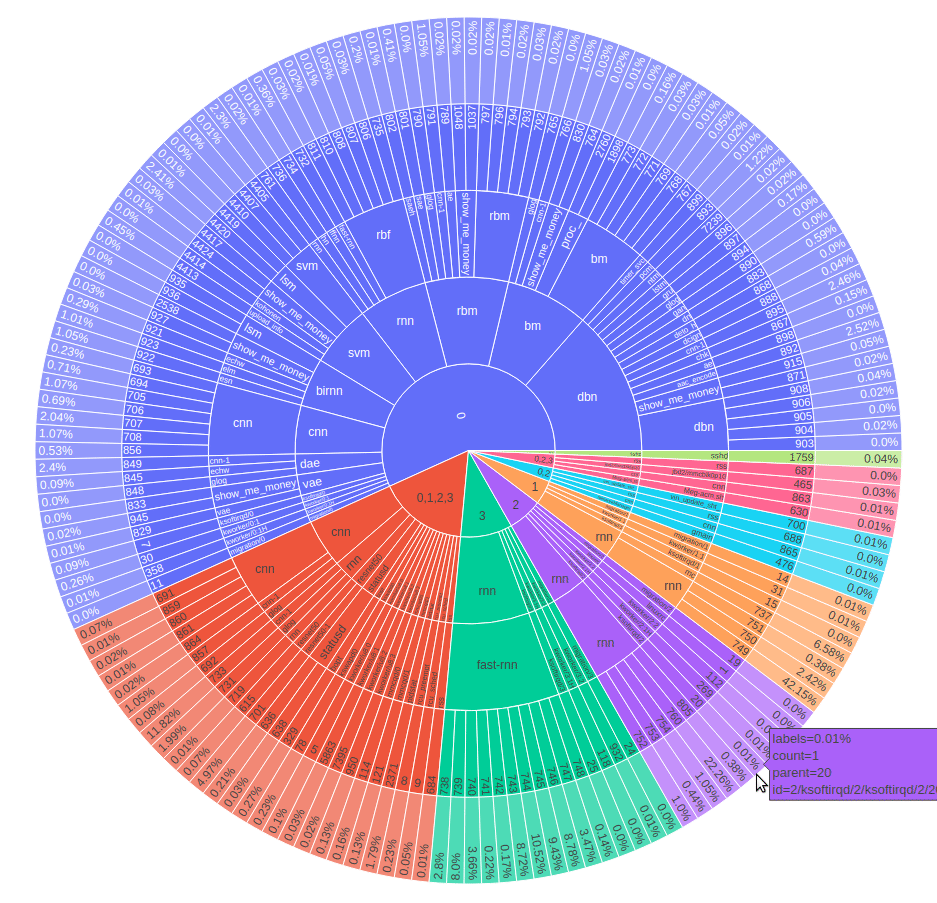
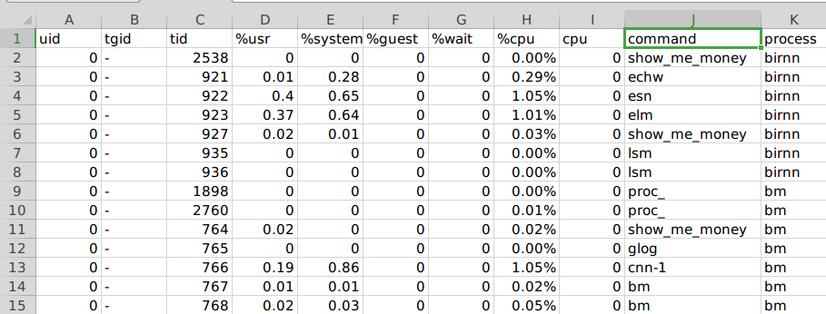
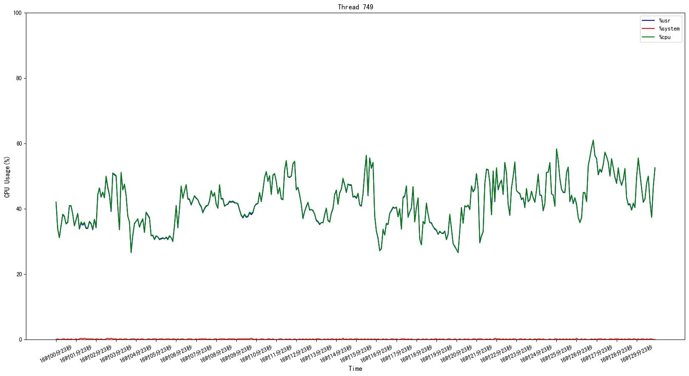
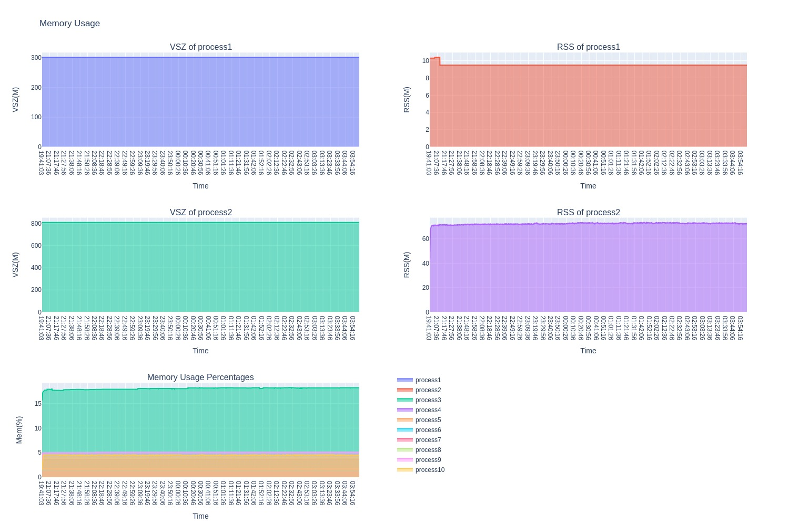
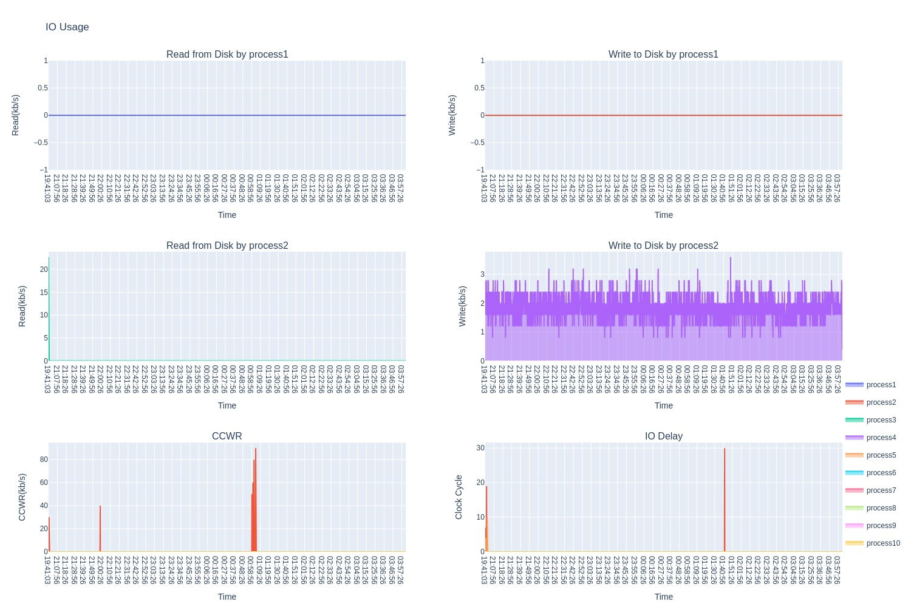
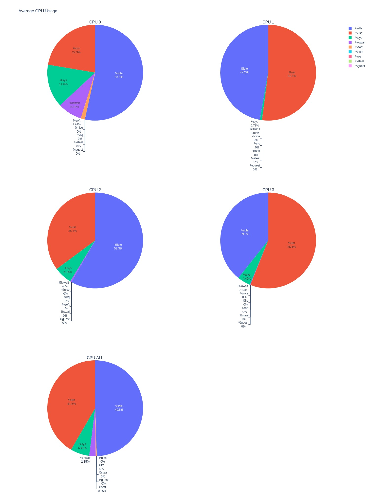

[English](README.md)

# SClean
SClean 是一个针对 Linux 下 sysstat 工具中各种套件的输出做数据清洗并可视化的工具。

## 目录
- [背景](#背景)
- [使用场景](#使用场景)
- [安装](#安装)
- [用法](#用法)
- [维护者](#维护者)

## 背景
很多时候我们有了性能分析工具，但通过工具拿到的 log 太长了，特别是长时间压测后得到的 log，一眼望去眼花缭乱，看不到重点，挑几个时间段看可能会因为局部性将你带入另一个误区。手动通过关键字过滤，要么因为文件太大打不开，要么因为过滤效果不佳，无法分析根因。SClean 的目的就是以 “上帝视角” 的眼光用可视化的形式展现性能分析的结果，帮助工程师快速定位问题的根因，节省大量本因是喝咖啡的时间，而此时却在埋头分析 log。

## 使用场景
- 嵌入式 Linux 环境下无法实时监控系统性能；
- 快速定位大量线程（几十个）运行在不同 CPU 核上造成的性能瓶颈；
- pidstat 获取到的 Average 数据看不到绑核情况，需要再分析；
- log 文件太大，需要耗费大量时间分析 log；
- Memory，IO，上下文切换次数在某个局部时间段内异常而影响全局判断；
- 想全局查看这段时间的性能状况，可视化显示一目了然。

## 安装
本工具使用 python3 语言编写。因此请先安装 python3。

### 安装依赖
```sh
$ pip install -r requirements.txt
```

### 安装 SimHei 字体
没有中文需求的可略过这步。如果你的系统工具输出 log 中有中文，比如日期 “2020年10月1日”，可以安装 SimHei 字体，不安装的话也不影响可视化输出，只是中文字显示乱码。
#### 修改 matplotlibrc 文件
找出你的 python3 环境下的 matplotlibrc 文件。如果你不知道在哪，可以这么做，打开一个 py 文件，写入代码：
```python
import matplotlib
print(matplotlib.matplotlib_fname())
```

运行后会显示一个路径，比如：
> ~/.local/lib/python3.7/site-packages/matplotlib/mpl-data/matplotlibrc

然后修改文件：~/.local/lib/python3.7/site-packages/matplotlib/mpl-data/matplotlibrc

- 去掉font.family前面的“#”，让该配置生效
- 去掉font.sans-serif前面的“#”，让该配置生效，并且加入SimHei字体，具体如下所示
```
font.family  : sans-serif
#font.style   : normal
#font.variant : normal
#font.weight  : normal
#font.stretch : normal
#font.size    : 10.0

#font.serif      : DejaVu Serif, Bitstream Vera Serif, Computer Modern Roman, New Century Schoolbook, Century Schoolbook L, Utopia, ITC Bookman, Bookman, Nimbus Roman No9 L, Times New Roman, Times, Palatino, Charter, serif
font.sans-serif : Arial, SimHei, Bitstream Vera Sans, Lucida Grande, Verdana, Geneva, Lucid, Helvetica, Avant Garde, sans-serif
#font.cursive    : Apple Chancery, Textile, Zapf Chancery, Sand, Script MT, Felipa, cursive
#font.fantasy    : Comic Neue, Comic Sans MS, Chicago, Charcoal, ImpactWestern, Humor Sans, xkcd, fantasy
#font.monospace  : DejaVu Sans Mono, Bitstream Vera Sans Mono, Computer Modern Typewriter, Andale Mono, Nimbus Mono L, Courier New, Courier, Fixed, Terminal, monospace

```

#### 拷贝字体
```
$ cp font/SimHei.ttf ~/.local/lib/python3.7/site-packages/matplotlib/mpl-data/fonts/ttf
```

#### 删除缓存：
```
$ rm ~/.cache/matplotlib
```

## 用法
SClean 是对 sysstat 工具的输出做数据清洗，因此在使用之前必须有一份 log 文件。
### pidstat 辅助分析
#### 线程 CPU 使用率分析
针对 pidstat，目前 SClean 只对线程级别做了数据清洗，因为我们大多数时候不清楚一个进程中的若干支线程它们的 CPU 状况。因此你的命令参数应该是 “-t”，比如：
```python
$ pidstat -t interval count  // interval 为时间间隔，count 为次数
```

假设你已经有了一份基于 pidstat 产生的 log：pidstat.log，注意 pidstat 必须录入到它正常结束，结束后的 log 会统计这段时间的平均值，SClean 也是对平均值做数据清洗。以下是个示例：
```
$ pidstat -t 5 360 > pidstat.log
```
```
Linux 4.15.0-112-generic (m2133)        2020年10月20日  _x86_64_        (12 CPU)

14时26分02秒      TGID       TID    %usr %system  %guest    %CPU   CPU  Command
14时26分03秒         -       344    0.96    0.00    0.00    0.96     0  |__chrome
14时26分03秒      1808         -    1.92    0.00    0.00    1.92     7  chrome
14时26分03秒         -      2620    1.92    0.00    0.00    1.92    11  |__Media
14时26分03秒         -     30579    0.96    0.96    0.00    1.92    10  |__PacerThread
......
Average:         TGID       TID    %usr %system  %guest    %CPU   CPU  Command
Average:            -       344    0.96    0.00    0.00    0.96     -  |__chrome
Average:         1808         -    1.92    0.00    0.00    1.92     -  chrome
Average:            -      2620    1.92    0.00    0.00    1.92     -  |__Media
Average:            -     30579    0.96    0.96    0.00    1.92     -  |__PacerThread

```

运行：
```
python sclean.py -p example/log/pidstat.log -pt
```

其中参数 “-p” 指定 log 路径，参数 “-pt” 指明对线程的 CPU 使用率进行分析。命令默认会针对第一个 CPU 核（CPU0）以及绑定了多个 CPU 核或者未绑定 CPU 核（表象是这支线程会在多个 CPU 核上运行）的所有线程 CPU 性能进行分析。运行结束后会生成三个文件：pidstat_bar.jpg，pidstat_cpu.csv，pidstat_sunburst.html。***注意，我们看到的这三个文件中的数值都是这段时间的平均值。***

***pidstat_bar.jpg*** 是针对指定 CPU 核上所有进程生成的柱状图，默认统计这段时间内用户态 CPU 平均使用率（%usr），内核态 CPU 平均使用率（%system），以及总 CPU 平均使用率（%CPU）。如下图：
<div align=center></div>

如果想看 pidstat 的其他指标可通过参数 “-ps” 指定，如果想指定 CPU 核可通过 “-c” 指定：
```
python sclean.py -p example/log/pidstat.log -pt -c 0 1 2 3 -ps guest usr system cpu
```
上面这条命令指定 CPU0，CPU1，CPU2，CPU3 四个 CPU 核，并显示指定的这四个指标：%guest，%usr，%system，%CPU。

***pidstat_sunburst.html*** 是一个旭日图，它显示指定 CPU 核内每个线程的 CPU 使用情况（%CPU）：
<div align=center></div>

- 从内向外数第五圈，也就是最外圈表示这支线程在这段时间内平均 CPU 使用率（%CPU）；
- 从内向外数第四圈表示线程号；
- 从内向外数第三圈表示线程名，线程名在不同核是有可能相同的，比如一个共享库创建的线程；
- 从内向外数第二圈表示第三圈线程所属的进程名，这一圈可能有同名的进程。比如这支进程内的线程可能绑在了不同的核上，归类时会划分到同一个进程；
- 最内圈表示表示第几个 CPU 核，如 “0” 表示仅运行在 CPU0 核上的所有进程/线程；“0,1,2,3”表示运行在 CPU0，CPU1，CPU2，CPU3 上的所有进程/线程（意思是这支线程要么绑定在 CPU0，CPU1，CPU2，CPU3 这四个核上；要么没绑核，会在 CPU0，CPU1，CPU2，CPU3 这四个核上浮动）；
- 每个核上有哪些进程，每支进程包含哪些线程，每支线程的线程号都通过圈内半径线区分；

***pidstat_cpu.csv*** 文件详细记录系统内所有线程的平均 CPU 使用情况：
<div align=center></div>
其中 command 列表示线程名，tid 表示线程号，跟 pidstat 的输出是一致的。线程所属的进程用 process 表示，cpu 表示对应的线程运行在第几个 CPU 核，tgid 这一列已经被过滤掉了，显示为 “-”，因为我们主要关注的是线程。

如果想进一步查看某支线程在这段时间内 CPU 使用情况的曲线变化图，可使用 ”-t” 参数，会生成一张以线程名为名字的折线图。
```
python sclean.py -p example/log/pidstat.log -pt -t 749
```
<div align=center></div>

如果只想显示自己关注进程的 CPU 状况，可使用 “-pp” 参数：
```
python sclean.py -p example/log/pidstat.log -pt -c 0 1 2 3 -pp rss cnn rnn rbm
```
这条命令只关注这几支进程：rss cnn rnn rbm

#### Memory 分析
因为是对内存进行数据分析，所以你录 log 的命令需要加上参数 “-r”，如下示例：
```
$ pidstat -C "process1|process2|process3|process4|process5|process6|process7|process8|process9|process10" -rdh -p ALL 10 > pidstat_mem_io.log
```

使用参数 “-pr” 会生成指定进程的内存使用率的折线图，如下命令：
```
python sclean.py -p example/log/pidstat_mem_io.log -pr
```
或者指定进程名进行过滤：
```
python sclean.py -p example/log/pidstat_mem_io.log -pr -pp process1 process2
```

最终会生成文件 ***pidstat_mem.html***。在 html 页面以交互式的形式显示每个进程的 VSZ、RSS 以及指定进程的内存使用率。
<div align=center></div>

#### IO 分析
因为是对 IO 进行数据分析，所以你录 log 的命令需要加上参数 “-d”，如下示例：
```
$ pidstat -C "process1|process2|process3|process4|process5|process6|process7|process8|process9|process10" -rdh -p ALL 10 > pidstat_mem_io.log
```

使用参数 “-pd” 会生成指定进程的 IO 使用率的折线图，如下命令：
```
python sclean.py -p example/log/pidstat_mem_io.log -pd
```
或者指定进程名进行过滤：
```
python sclean.py -p example/log/pidstat_mem_io.log -pd -pp process1 process2
```
最终会生成文件 ***pidstat_io.html***。在 html 页面以交互式的形式显示指定进程每秒读写磁盘的大小，以及 CCWR 和 IO Delay 的状态。
<div align=center></div>

### mpstat 辅助分析
mpstat 的 log 录制可以使用如下命令：
```
mpstat -P ALL 5 360 > mpstat.log // 每隔 5s 输出一次，一共记录 360 次，也就是会录制半小时的 log
```

运行：
```
python sclean.py -m example/log/mpstat.log -c 0 1 2 3
```

这条命令会生成三个文件：mpstat.csv，mpstat_line.jpg，mpstat_pie.html。

***mpstat_line.jpg*** 以折线图的形式显示这段时间内指定 CPU 核的 CPU 性能曲线，默认显示这几个指标：%usr，%sys，%iowait，%idle。
<div align=center></div>

如果想看 mpstat 的其他指标可通过参数 “-ms” 指定：
运行：
```
python sclean.py -m example/log/mpstat.log -c 0 1 2 3 -ms usr nice irq soft
```

这条命令指定了这几个 CPU 指标：%usr，%nice，%irq，%soft。

***mpstat_pie.html*** 以饼图的形式显示这段时间内 CPU 平均性能指标。下图显示 CPU0，CPU1，CPU2，CPU3 这四个 CPU 核每个核的平均性能指标，CPU ALL 表示这四个核的加在一起的平均性能指标。
<div align=center></div>

***mpstat.csv*** 是清洗后的数据。

### vmstat 辅助分析
vmstat 的 log 录制可以使用如下命令：
```
vmstat 5 360 > vmstat.log // 每隔 5s 输出一次，一共记录 360 次，也就是会录制半小时的 log
```

运行：
```
python sclean.py -v example/log/vmstat.log
```

这条命令会生成文件：vmstat_line.jpg 以及 vmstat.csv。我们主要关注 ***vmstat_line.jpg*** ,这张图以折线图的形式显示这段时间内的 Memory 使用状况。下图中有一根虚线，设定值是 20 M，可以辅助看曲线是否有触及这根线。
<div align=center></div>

当然 vmstat 上有的指标都能显示：
```
python sclean.py -v example/log/vmstat.log -vm -vi -vs -vc
```

这条命令显示这段时间 Memory，IO，System，CPU 的使用状况。
<div align=center></div>

### 其他参数
- “-o” 参数指定输出文件的路径。
- “-pic” 参数指定保存为 jpg 格式。

## 维护者
[@Seven](https://github.com/stoneboy100200).
